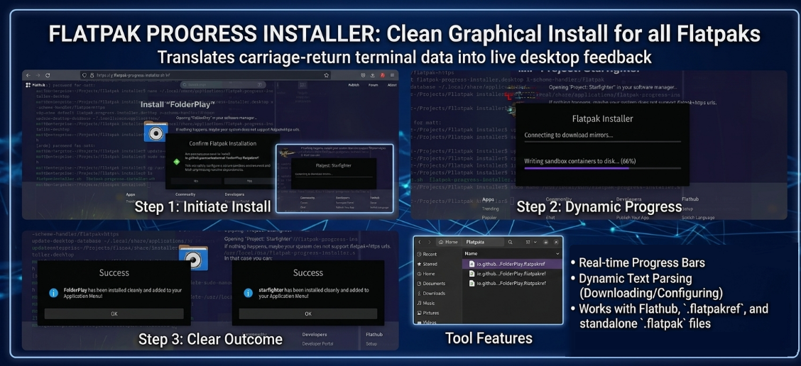

# Flatpak Progress Installer


A native graphical user interface wrapper built to capture and stream real-time installation progress data out of the Linux Flatpak ecosystem into clean desktop dialogues.

## Motivation
I developed this tool out of personal necessity. I frequently found that standard graphical software managers sometimes struggled to process specific Flatpak installations or .flatpakref files consistently.

While I appreciate the convenience of large software centers, I wanted a lightweight solution that offered the reliability of a terminal installation combined with the visual feedback of a GUI. This project was born from my desire to bridge that gap—providing a transparent, real-time progress view for installations without the overhead of a full software manager.

This tool is built for users who want to know exactly what is happening under the hood during their Flatpak setup.

## 🚀 Quick Installation

Open your terminal, clone this repository, and run the automated installation script:

```bash
git clone [https://github.com/YOUR_GITHUB_USERNAME/flatpak-progress-installer.git](https://github.com/YOUR_GITHUB_USERNAME/flatpak-progress-installer.git)
cd flatpak-progress-installer
chmod +x install.sh
./install.sh
```

## 💡 How to Use
* **In Your Browser (Brave/Firefox/Chrome):** Go to Flathub, click **Install** on any app, and select **Open xdg-open** when prompted.
* **In Your File Manager (Nemo/Files):** Double-click any downloaded `.flatpakref` or `.flatpak` file.
